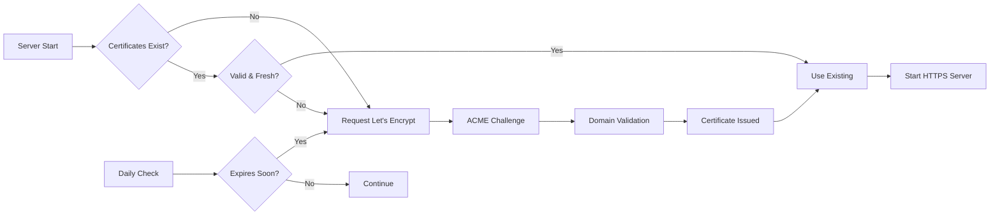

# 🔒 SSL/TLS Deployment Guide
## Automatic Let's Encrypt Certificate Management

---

## 🚀 Quick Start

**Zero-configuration HTTPS deployment:**

```env
# Add to your production environment variables
TLS_DOMAIN=abcdeez.fg-goose.online
TLS_USE_LETSENCRYPT=true
TLS_PORT=443
ADMIN_EMAIL=admin@yourdomain.com
```

Deploy and your server automatically gets HTTPS! 🎉

---

## 📋 Complete Setup Checklist

### **Prerequisites**
- [ ] Domain name pointing to your server
- [ ] Ports 80 and 443 open
- [ ] Valid admin email address
- [ ] Server with persistent storage

### **DNS Configuration**
```dns
# A records pointing to your server
abcdeez.fg-goose.online.           A    YOUR_SERVER_IP
staging.abcdeez.fg-goose.online.   A    YOUR_STAGING_IP
*.abcdeez.fg-goose.online.         A    YOUR_SERVER_IP  # Optional wildcard
```

### **Environment Variables**
```env
# Production HTTPS Configuration
ENVIRONMENT=production
TLS_DOMAIN=abcdeez.fg-goose.online
TLS_USE_LETSENCRYPT=true
TLS_PORT=443
PORT=80
ADMIN_EMAIL=admin@yourdomain.com

# Staging HTTPS Configuration  
ENVIRONMENT=staging
TLS_DOMAIN=staging.abcdeez.fg-goose.online
TLS_USE_LETSENCRYPT=true
TLS_PORT=443
PORT=80
ADMIN_EMAIL=admin@yourdomain.com
```

---

## 🔧 How It Works

### **Automatic Certificate Provisioning**

1. **Server Startup**: TLS manager checks for existing certificates
2. **ACME Account**: Creates Let's Encrypt account (saved to `./certs/acme_account.key`)
3. **Domain Validation**: Handles HTTP-01 challenges automatically
4. **Certificate Download**: Retrieves and stores certificates
5. **HTTPS Activation**: Starts secure server with new certificates

### **Certificate Lifecycle**



### **Directory Structure**
```
./certs/
├── abcdeez.fg-goose.online.crt        # Certificate chain
├── abcdeez.fg-goose.online.key        # Private key
├── acme_account.key                    # Let's Encrypt account
└── staging.abcdeez.fg-goose.online.crt # Staging certificates
```

---

## 🌐 Server Architecture

### **Dual-Server Setup**
The system runs two servers simultaneously:

**HTTPS Server (Port 443)**
- Serves all application traffic
- Uses Let's Encrypt certificates
- Full API and web interface

**HTTP Server (Port 80)**  
- Redirects to HTTPS
- Handles ACME challenges
- Serves `/.well-known/acme-challenge/`

### **Traffic Flow**
```
HTTP Request (Port 80)
    ↓
Is ACME Challenge?
    ↓ No          ↓ Yes
Redirect HTTPS   Serve Challenge
    ↓
HTTPS Request (Port 443)
    ↓
Application Response
```

---

## 🛠️ Configuration Options

### **Environment Variables Reference**

| Variable | Required | Default | Description |
|----------|----------|---------|-------------|
| `TLS_DOMAIN` | Yes* | `None` | Domain for SSL certificate |
| `TLS_USE_LETSENCRYPT` | No | `true` | Use Let's Encrypt vs self-signed |
| `TLS_PORT` | No | `443` | HTTPS port |
| `PORT` | No | `80` | HTTP port |
| `ADMIN_EMAIL` | Yes | `None` | Email for Let's Encrypt account |
| `ENVIRONMENT` | No | `development` | Skip TLS if not production |

*Required for production HTTPS

### **Development Configuration**
```env
# HTTP only - no TLS
# TLS_DOMAIN=  # Leave empty or undefined
ENVIRONMENT=development
PORT=8080
```

### **Self-Signed Certificates**
```env
# For testing without Let's Encrypt
TLS_DOMAIN=localhost
TLS_USE_LETSENCRYPT=false
TLS_PORT=443
```

---

## 📊 Monitoring & Management

### **Admin Panel Integration**
The admin panel shows certificate status:

```
🔒 SSL Certificate Status
Domain: abcdeez.fg-goose.online
Status: ✅ Valid
Expires: 2024-03-15 12:34:56 UTC
Auto-Renew: ✅ Enabled
Last Check: 2024-01-15 08:30:22 UTC
```

### **Log Monitoring**
```bash
# Certificate provisioning logs
grep "Let's Encrypt" /var/log/app.log

# Certificate renewal logs
grep "certificate renewal" /var/log/app.log

# ACME challenge logs
grep "ACME challenge" /var/log/app.log
```

### **Health Checks**
```bash
# Certificate validity
curl -I https://abcdeez.fg-goose.online

# ACME challenge endpoint
curl http://abcdeez.fg-goose.online/.well-known/acme-challenge/test

# SSL Labs test
https://www.ssllabs.com/ssltest/analyze.html?d=abcdeez.fg-goose.online
```

---

## 🚨 Troubleshooting

### **Common Issues**

**1. Domain Validation Failed**
```
Error: ACME challenge validation failed
```
**Solutions:**
- Ensure domain points to server IP
- Check port 80 is accessible
- Verify no firewall blocking ACME challenges
- Confirm `/.well-known/acme-challenge/` endpoint works

**2. Rate Limited by Let's Encrypt**
```
Error: too many certificates already issued
```
**Solutions:**
- Wait for rate limit reset (weekly)
- Use staging environment for testing
- Implement certificate caching

**3. Permission Denied Writing Certificates**
```
Error: Failed to write certificate file
```
**Solutions:**
- Check `./certs/` directory permissions
- Ensure process can write to filesystem
- Verify disk space available

**4. Certificate Renewal Failed**
```
Warning: Certificate renewal check failed
```
**Solutions:**
- Check network connectivity
- Verify domain still points to server
- Review ACME account credentials

### **Emergency Procedures**

**Force Certificate Renewal**
```bash
# Remove existing certificates
rm ./certs/abcdeez.fg-goose.online.*

# Restart server (will auto-provision)
systemctl restart graph-learning-system
```

**Fallback to HTTP**
```env
# Emergency HTTP-only mode
# TLS_DOMAIN=  # Comment out or remove
ENVIRONMENT=development
```

**Manual Certificate Installation**
```bash
# If Let's Encrypt fails, use manual certificates
cp manual.crt ./certs/abcdeez.fg-goose.online.crt  
cp manual.key ./certs/abcdeez.fg-goose.online.key
systemctl restart graph-learning-system
```

---

## 🔐 Security Considerations

### **TLS Configuration**
- **Protocol**: TLS 1.2+ only
- **Cipher Suites**: Modern, secure ciphers
- **HSTS**: HTTP Strict Transport Security enabled
- **Certificate Transparency**: Logged to CT logs

### **Certificate Storage**
- **Permissions**: Certificate files readable by process only
- **Backup**: Include `./certs/` in backups
- **Rotation**: Automatic 90-day Let's Encrypt rotation
- **Monitoring**: Daily renewal checks

### **ACME Security**
- **Account Key**: Securely stored, backed up
- **Challenge Validation**: Domain ownership verified
- **Rate Limiting**: Let's Encrypt enforced limits
- **Audit Trail**: All certificate operations logged

---

## 📈 Performance Impact

### **TLS Overhead**
- **CPU**: ~1-3% additional CPU for encryption
- **Memory**: ~10MB additional for certificate storage
- **Latency**: ~20-50ms additional handshake time
- **Throughput**: ~5-10% reduction in peak throughput

### **Optimization**
- **Session Resumption**: Enabled for faster reconnections  
- **OCSP Stapling**: Reduces certificate validation latency
- **Connection Pooling**: Reuses TLS connections
- **Certificate Caching**: Avoids repeated disk reads

---

## 📋 Deployment Checklist

### **Pre-Deployment**
- [ ] Domain DNS configured
- [ ] Ports 80/443 open
- [ ] Admin email configured
- [ ] Environment variables set
- [ ] Firewall configured

### **Post-Deployment**
- [ ] HTTPS site accessible
- [ ] HTTP redirects to HTTPS
- [ ] Certificate valid and trusted
- [ ] Admin panel shows certificate status
- [ ] Renewal scheduled and working

### **Testing**
- [ ] SSL Labs A+ rating
- [ ] ACME challenge responds correctly
- [ ] Certificate auto-renewal works
- [ ] Fallback to self-signed works
- [ ] Admin panel certificate monitoring

---

## 📚 Additional Resources

### **Let's Encrypt Documentation**
- [ACME Protocol](https://letsencrypt.org/docs/client-options/)
- [Rate Limits](https://letsencrypt.org/docs/rate-limits/)
- [Certificate Transparency](https://letsencrypt.org/docs/ct-logs/)

### **SSL/TLS Best Practices**
- [Mozilla SSL Configuration Generator](https://ssl-config.mozilla.org/)
- [OWASP TLS Cheat Sheet](https://cheatsheetseries.owasp.org/cheatsheets/Transport_Layer_Protection_Cheat_Sheet.html)

### **Testing Tools**
- [SSL Labs Server Test](https://www.ssllabs.com/ssltest/)
- [Certificate Transparency Logs](https://crt.sh/)
- [OpenSSL Commands](https://www.openssl.org/docs/man1.1.1/man1/openssl.html)

---

**🔒 Your Graph Learning System now has production-grade SSL/TLS security with zero manual certificate management!**

*Last Updated: $(date)*
*Version: 1.0*
*Maintained by: Platform Team*