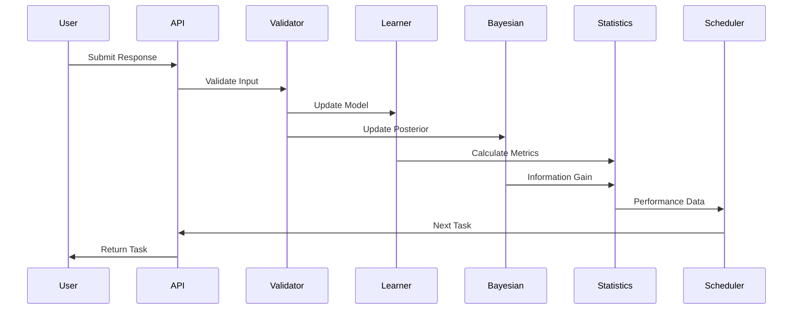

# System Architecture

This chapter details the architectural design of ABCDeez Core, explaining how components interact and the reasoning behind key design decisions.

## Architectural Principles

### Separation of Concerns
Each module has a clearly defined responsibility:
- **Core**: Data structures and configuration
- **Learning**: Cognitive models and updates
- **Statistics**: Mathematical and statistical operations
- **Tasks**: Assessment generation and scheduling

### Type Safety
Rust's type system is leveraged throughout:
- Strong typing prevents many runtime errors
- Enums represent discrete categories (e.g., `OperationType`, `TaskType`)
- NewType pattern for domain-specific types
- Result types for explicit error handling

### Composability
Components are designed to work independently or together:
```rust
// Use just the statistics module
let stats = DetailedStatistics::from_data(&response_times);

// Or combine with learning models
let learner = LearnerModel::new(id, &topology);
let rt_dist = learner.predict_response_time(&operation, distance);
```

## Module Structure

### Core Module (`core/`)

The foundation layer providing:

```rust
pub mod config;     // Configuration with validation
pub mod topology;   // Knowledge structure representation  
pub mod error;      // Error types and handling
```

Key types:
- `Topology`: Represents knowledge structures (linear, cyclic, DAG, graph)
- `LearnerConfig`: Validated configuration for learning parameters
- `Error`: Comprehensive error enumeration

### Learning Module (`learning/`)

Cognitive modeling components:

```rust
pub mod learner;    // Individual learner models
pub mod bayesian;   // Bayesian inference framework
pub mod scheduler;  // Adaptive scheduling algorithms
```

Key types:
- `LearnerModel`: Tracks individual learning state
- `BayesianLearnerModel`: Probabilistic inference and uncertainty
- `AdaptiveScheduler`: Optimal task sequencing

### Statistics Module (`statistics/`)

Statistical analysis tools:

```rust
pub mod core;              // Basic statistics and distributions
pub mod distributions;     // Ex-Gaussian, response times
pub mod analysis;         // Strategy classification, patterns
pub mod validation;       // Cross-validation, bootstrap
pub mod power_analysis;   // Effect sizes, sample size
pub mod math_validation;  // Safe mathematical operations
```

Key types:
- `ExGaussianDistribution`: Response time modeling
- `StrategyClassifier`: Identifies cognitive strategies
- `PowerAnalyzer`: Statistical power calculations
- `StatisticalValidator`: Assumption checking

### Tasks Module (`tasks/`)

Assessment generation:

```rust
pub mod generation;   // Task creation
pub mod selection;    // Adaptive selection
pub mod difficulty;   // Calibration algorithms
```

Key types:
- `Task`: Assessment item representation
- `TaskGenerator`: Creates tasks from topology
- `DifficultyCalibrator`: Adjusts task difficulty

## Data Flow Architecture

### Response Processing Pipeline



### Model Update Flow

When a response is processed:

1. **Validation**: Input validation and sanitization
2. **Learner Update**: 
   - Update node embeddings
   - Adjust operation proficiency
   - Update memory strength
   - Detect chunk boundaries
3. **Bayesian Update**:
   - Update posterior distributions
   - Recalculate uncertainties
   - Compute information metrics
4. **Statistical Analysis**:
   - Classify strategy
   - Fit response time distribution
   - Calculate performance metrics
5. **Task Selection**:
   - Compute expected information gain
   - Apply scheduling constraints
   - Select optimal next task

## Memory Management

### Incremental Updates
Models use incremental update algorithms to avoid storing full history:

```rust
// Instead of storing all responses:
// history: Vec<ResponseData>  // ❌ O(n) memory

// We maintain sufficient statistics:
pub struct LearnerModel {
    node_embeddings: HashMap<String, LatentNodeEmbedding>,     // O(|nodes|)
    operation_proficiencies: HashMap<String, OperationProficiency>, // O(|ops|)
    memory_strengths: HashMap<String, MemoryStrength>,         // O(|nodes|)
    // ... other compact representations
}
```

### Lazy Computation
Expensive calculations are deferred until needed:

```rust
impl BayesianLearnerModel {
    // Information gain computed on-demand, not stored
    pub fn monte_carlo_eig(&self, task: &Task, n_samples: usize) -> f64 {
        // Computed when needed for task selection
    }
}
```

## Concurrency Design

### Thread Safety
Core data structures are designed for safe concurrent access:

```rust
// Immutable methods for read-only access
impl LearnerModel {
    pub fn get_retention_probability(&self, node_id: &str) -> f64 { }
}

// Explicit mutation for updates
impl LearnerModel {
    pub fn update_with_response(&mut self, response: &ResponseData) { }
}
```

### Parallelization Opportunities
Statistical computations can be parallelized:

```rust
// Monte Carlo simulations
let samples: Vec<f64> = (0..n_samples)
    .into_par_iter()  // Parallel iteration with rayon
    .map(|_| simulate_response())
    .collect();
```

## Error Handling Strategy

### Explicit Error Types
All fallible operations return `Result<T, Error>`:

```rust
pub enum Error {
    InvalidInput(String),
    StatisticalAssumptionViolation(String),
    NumericalInstability(String),
    // ... other variants
}
```

### Graceful Degradation
When optimal methods fail, fallback strategies are employed:

```rust
// Try sophisticated method first
match calculate_exact_information_gain() {
    Ok(eig) => eig,
    Err(_) => {
        // Fall back to Monte Carlo approximation
        monte_carlo_approximation()
    }
}
```

## Extension Points

### Custom Topologies
New knowledge structures can be added:

```rust
impl Topology {
    pub fn custom(builder: TopologyBuilder) -> Self {
        // Build custom topology
    }
}
```

### Strategy Plugins
New cognitive strategies can be registered:

```rust
trait CognitiveStrategy {
    fn classify(&self, responses: &[ResponseData]) -> StrategyType;
    fn predict_rt(&self, task: &Task) -> f64;
}
```

### Statistical Methods
Additional statistical methods can be integrated:

```rust
trait StatisticalTest {
    fn test(&self, data: &[f64]) -> TestResult;
    fn assumptions_met(&self, data: &[f64]) -> bool;
}
```

## Performance Considerations

### Algorithmic Complexity
- Node embedding updates: O(1)
- Memory strength updates: O(1)
- Strategy classification: O(n log n)
- Information gain: O(m) where m is Monte Carlo samples
- Model comparison: O(n) where n is parameters

### Memory Footprint
- Per learner: ~10KB base + O(nodes + operations)
- Per Bayesian model: ~50KB base + O(nodes²)
- Statistical cache: Configurable, typically <1MB

### Optimization Strategies
1. **Sufficient Statistics**: Store summaries, not raw data
2. **Incremental Updates**: Avoid recomputation
3. **Lazy Evaluation**: Compute only when needed
4. **Caching**: Memoize expensive calculations
5. **Vectorization**: Use SIMD where applicable

## Security Considerations

### Input Validation
All external inputs are validated:
```rust
impl Task {
    pub fn new(params: TaskParams) -> Result<Self, Error> {
        params.validate()?;  // Comprehensive validation
        // ... construction
    }
}
```

### Resource Limits
Prevent resource exhaustion:
```rust
const MAX_MONTE_CARLO_SAMPLES: usize = 10_000;
const MAX_NODES: usize = 1_000;
const MAX_SESSION_LENGTH: usize = 10_000;
```

### Privacy
No personally identifiable information in core models:
- Learner IDs are opaque strings
- No storage of raw response content
- Statistical aggregates only

## Next Steps

- Explore [Key Features](./features.md) in detail
- Learn about [Research Applications](./research.md)
- Dive into [Core Module](../api/core.md) implementation