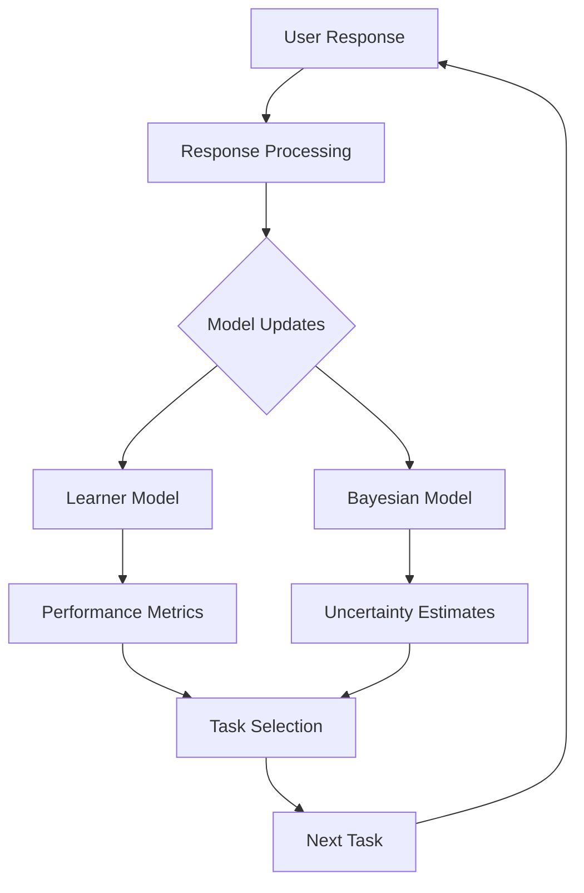

# System Overview

ABCDeez Core is a comprehensive system for modeling human learning and cognitive assessment. This chapter provides a high-level overview of the system's architecture, design principles, and core components.

## Design Philosophy

The system is built on three fundamental principles:

### 1. Scientific Validity
Every algorithm and model is grounded in peer-reviewed cognitive science research. We don't just implement mathematical models—we ensure they accurately reflect human cognitive processes.

### 2. Statistical Rigor
All statistical methods are implemented with proper attention to assumptions, edge cases, and numerical stability. We use robust methods where appropriate and always quantify uncertainty.

### 3. Practical Usability
Despite its sophistication, the system provides clean, intuitive APIs that make it easy to build real-world applications for education and research.

## System Components

### Core Infrastructure

The foundation of the system consists of:

- **Topology System**: Flexible representation of knowledge structures
- **Configuration Management**: Type-safe, validated configuration with sensible defaults
- **Error Handling**: Comprehensive error types with informative messages

### Cognitive Models

The learning subsystem implements sophisticated models of human cognition:

- **Learner Model**: Tracks individual learning progress, memory strength, and strategic development
- **Bayesian Framework**: Provides principled uncertainty quantification and optimal task selection
- **Memory Dynamics**: Models forgetting curves, spacing effects, and retrieval practice benefits

### Statistical Engine

A comprehensive suite of statistical tools:

- **Distribution Modeling**: Ex-Gaussian and other cognitive distributions
- **Hypothesis Testing**: Parametric and non-parametric tests with effect sizes
- **Validation Methods**: Cross-validation, bootstrap, and simulation-based validation
- **Robust Statistics**: Methods resistant to outliers and violations of assumptions

### Assessment System

Intelligent task generation and selection:

- **Adaptive Algorithms**: Information-theoretic selection of optimal next items
- **Difficulty Calibration**: Dynamic adjustment based on performance
- **Scheduling**: Optimal review timing based on memory decay models

## Data Flow



## Key Innovations

### 1. Unified Cognitive Framework
Unlike systems that treat different aspects of learning separately, ABCDeez Core provides an integrated model that captures:
- Memorization and forgetting
- Strategic development
- Individual differences
- Transfer effects

### 2. Information-Theoretic Assessment
Tasks are selected not randomly or by fixed sequences, but using information theory to maximize learning efficiency:
- Expected Information Gain (EIG) calculations
- Optimal experimental design principles
- Adaptive difficulty calibration

### 3. Validated Psychological Models
The system reproduces numerous well-established psychological phenomena:
- Serial position curves (primacy and recency)
- Power law of practice
- Spacing effects in memory
- Strategy shifts with expertise

### 4. Research-Grade Statistics
Statistical methods go beyond basic calculations to provide:
- Proper handling of response time distributions
- Multiple comparison corrections
- Model comparison metrics
- Robust estimation techniques

## Use Cases

### Educational Assessment
- Adaptive testing that adjusts to student ability
- Optimal review scheduling for long-term retention
- Detailed progress tracking with uncertainty bounds

### Cognitive Research
- Testing theories of human learning and memory
- Analyzing strategy development and expertise
- Investigating individual differences

### Clinical Applications
- Cognitive assessment for diagnostic purposes
- Tracking cognitive changes over time
- Personalized cognitive training programs

## Performance Characteristics

The system is designed for both accuracy and efficiency:

- **Memory Efficient**: Incremental updates without storing all historical data
- **Computationally Scalable**: O(n) or O(n log n) algorithms for most operations
- **Numerically Stable**: Careful handling of edge cases and extreme values
- **Thread Safe**: Designed for concurrent use in web services

## Integration Points

ABCDeez Core is designed as a library that can be integrated into larger systems:

```rust
// Example integration
let topology = Topology::alphabet();
let mut learner = LearnerModel::new(user_id, &topology);
let mut bayesian = BayesianLearnerModel::new(&topology);

// Process a learning session
for response in session.responses() {
    learner.update_with_response(&response);
    bayesian.update_with_response(response.clone());
    
    // Get next optimal task
    let next_task = bayesian.select_next_task(TaskType::Adaptive);
    
    // Check if review is needed
    let needs_review = learner.get_items_needing_review(0.8);
}

// Export metrics
let metrics = LearnerMetrics::from_model(&learner);
let comparison = bayesian.model_comparison_metrics();
```

## Next Steps

- Learn about the [Architecture](./architecture.md) in detail
- Explore [Key Features](./features.md) with examples
- Understand [Research Applications](./research.md)
- Jump to [API Reference](../api/introduction.md) for implementation