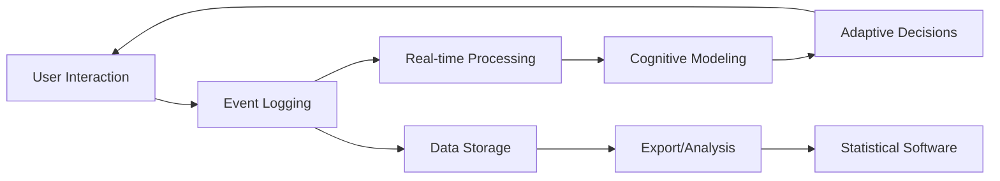

# Research Overview

Welcome to the Researcher Guide for the Adaptive Learning System. This section is designed for cognitive scientists, data analysts, graduate students, and advanced undergraduates interested in using our platform for research on human learning and cognition.

## System as a Research Tool

The Adaptive Learning System is more than an educational platform—it's a sophisticated research instrument designed to study sequential learning, memory formation, and cognitive adaptation. Built on decades of cognitive science research, it provides:

- **Millisecond-precision timing** for response time analysis
- **Comprehensive data logging** of every user interaction
- **Reproducible experimental conditions** with seeded randomization
- **Real-time cognitive modeling** using Bayesian inference
- **Rich export formats** for statistical analysis

## Core Research Capabilities

### 📊 Data Collection

The system captures extensive data for every learning session:

#### Behavioral Metrics
- Response accuracy (correct/incorrect)
- Response times (millisecond precision)
- Answer selection patterns
- Hint usage frequency and timing
- Session duration and task completion rates

#### Cognitive Indicators
- **Bidirectionality Index**: Asymmetry between forward and backward recall
- **Symbolic Distance Effect**: Response time as a function of item separation
- **Chunk Boundary Penalties**: Performance drops at conceptual boundaries
- **Learning Curves**: Acquisition rates and forgetting patterns
- **Strategy Detection**: Identification of learning strategies

#### Process Data
- Complete interaction logs (every click/tap)
- Task presentation order
- Adaptive algorithm decisions
- Intervention triggers
- State transitions

### 🧪 Experimental Control

Researchers can precisely control experimental conditions:

#### Deterministic Mode
```rust
// Example: Running a reproducible experiment
let seed = 42;
let session = DeterministicSession::new(seed);
// Every participant gets identical task sequences
```

#### Condition Manipulation
- Fixed vs. adaptive task selection
- Hint availability and timing
- Difficulty progression curves
- Domain-specific parameters
- Intervention thresholds

#### A/B Testing Framework
- Random assignment to conditions
- Balanced experimental designs
- Counter-balancing support
- Between/within-subject designs

### 🔬 Theoretical Foundations

The system implements several cognitive theories:

#### Memory Models
- **ACT-R**: Activation-based memory retrieval
- **Instance Theory**: Exemplar-based learning
- **Chunking Theory**: Hierarchical knowledge organization

#### Learning Theories
- **Spacing Effect**: Optimal interval scheduling
- **Testing Effect**: Retrieval practice benefits
- **Desirable Difficulties**: Optimal challenge levels
- **Transfer Learning**: Cross-domain skill application

#### Statistical Models
- **Ex-Gaussian Distribution**: Response time modeling
- **Bayesian Knowledge Tracing**: Skill mastery estimation
- **Item Response Theory**: Difficulty calibration
- **Hidden Markov Models**: Learning state transitions

## Research Applications

### Cognitive Psychology
- Sequential learning mechanisms
- Working memory capacity limits
- Chunking and pattern recognition
- Skill acquisition and expertise
- Cognitive load optimization

### Educational Psychology
- Adaptive instruction effectiveness
- Personalized learning trajectories
- Hint timing and effectiveness
- Motivation and engagement
- Transfer of learning

### Neuroscience
- Response time distributions
- Error-related processing
- Learning consolidation
- Cognitive control mechanisms
- Individual differences

### Clinical Applications
- Cognitive assessment tools
- Learning disability detection
- Intervention effectiveness
- Rehabilitation protocols
- Progress monitoring

## Data Pipeline



### Collection
1. **Raw Events**: Every interaction timestamped to millisecond
2. **Processed Metrics**: Computed in real-time
3. **Model Updates**: Bayesian inference after each response
4. **Session Aggregates**: Summary statistics

### Storage
- **Local SQLite**: Development/testing
- **PostgreSQL**: Production deployment
- **JSON Export**: Archival and sharing
- **CSV Export**: Statistical analysis

### Analysis
- **Built-in Analytics**: Dashboard visualizations
- **Python Integration**: Pandas, NumPy, SciPy
- **R Integration**: tidyverse, lme4, BayesFactor
- **MATLAB Export**: Psychophysics Toolbox compatible

## Key Research Features

### 1. Millisecond Timing Precision
```python
# Example response time data
{
    "task_id": "abc_123",
    "stimulus_onset": 1704067200.123,
    "response_time": 1847,  # milliseconds
    "accuracy": true,
    "confidence": 0.89
}
```

### 2. Cognitive Metric Computation
```python
# Bidirectionality Index calculation
def compute_bidirectionality(responses):
    forward = [r for r in responses if r.direction == 'forward']
    backward = [r for r in responses if r.direction == 'backward']
    
    forward_acc = mean([r.correct for r in forward])
    backward_acc = mean([r.correct for r in backward])
    
    return (forward_acc - backward_acc) / (forward_acc + backward_acc)
```

### 3. Learning Curve Analysis
```python
# Exponential learning curve fitting
def fit_learning_curve(trial_data):
    from scipy.optimize import curve_fit
    
    def exponential(x, a, b, c):
        return a * (1 - np.exp(-b * x)) + c
    
    params, _ = curve_fit(exponential, 
                          trial_data.trial_num, 
                          trial_data.accuracy)
    return params
```

### 4. Response Time Modeling
```python
# Ex-Gaussian parameter estimation
def fit_exgaussian(response_times):
    from scipy.stats import exponnorm
    
    params = exponnorm.fit(response_times)
    mu, sigma, lambda_param = params
    
    return {
        'mu': mu,  # Gaussian mean
        'sigma': sigma,  # Gaussian SD
        'tau': 1/lambda_param  # Exponential rate
    }
```

## Ethical Considerations

### Data Privacy
- **Anonymization**: Automatic PII removal
- **Consent Management**: Built-in consent workflows
- **GDPR Compliance**: Right to deletion, data portability
- **Secure Storage**: Encryption at rest and in transit

### Research Ethics
- **IRB Templates**: Pre-approved protocol templates
- **Participant Welfare**: Break reminders, session limits
- **Informed Consent**: Clear explanation of data use
- **Debriefing Materials**: Automated generation

### Data Sharing
- **De-identification**: Remove identifying information
- **Aggregation Options**: Group-level summaries
- **Open Science**: OSF integration ready
- **Citation Standards**: DOI generation for datasets

## Getting Started with Research

### Quick Start for Researchers

1. **Design Your Study**
   - Define research questions
   - Choose domains and tasks
   - Set experimental conditions

2. **Configure the System**
   ```python
   study_config = {
       'name': 'Sequential Learning Study',
       'conditions': ['adaptive', 'random'],
       'domains': ['alphabet', 'numbers'],
       'n_trials': 100,
       'seed': 42
   }
   ```

3. **Recruit Participants**
   - Generate study links
   - Manage assignments
   - Track completion

4. **Collect Data**
   - Monitor in real-time
   - Check data quality
   - Handle exceptions

5. **Export and Analyze**
   - Download datasets
   - Run statistical analyses
   - Generate reports

### Sample Research Questions

The system is ideal for investigating:

- How does spacing affect sequential learning?
- What role does chunking play in memory organization?
- How do individuals differ in learning strategies?
- Can we predict learning trajectories from early performance?
- What is the optimal difficulty progression for learning?
- How does hint timing affect knowledge retention?
- Do cognitive metrics predict real-world performance?

## Advanced Capabilities

### Custom Topologies
Create domain-specific learning sequences:
```rust
let custom_topology = Topology::new(
    vec!["alpha", "beta", "gamma", "delta"],
    EdgeType::Bidirectional,
    ChunkSize::Fixed(2)
);
```

### Intervention Design
Implement custom intervention logic:
```rust
let intervention = InterventionRule::new()
    .trigger_on_errors(3)
    .provide_hint(HintLevel::Moderate)
    .adjust_difficulty(-0.1);
```

### Real-time Analysis
Stream data for live analysis:
```python
async def stream_responses(session_id):
    async for response in session.responses():
        metric = compute_metric(response)
        await dashboard.update(metric)
```

## Next Steps

Ready to design your first experiment? Continue to:

1. [Experimental Design](./experiments.md) - Set up your study
2. [Advanced Metrics](./metrics.md) - Understand the measurements
3. [Data Analysis](./analysis.md) - Process your results
4. [API Documentation](./api.md) - Integrate with your tools

## Support for Researchers

- **Technical Support**: ember@lunar.town
- **Statistical Consulting**: Available for study design
- **Custom Development**: Extensions for specific needs
- **Training Workshops**: Monthly online sessions
- **Research Community**: Join our Slack channel

---

*"In God we trust. All others must bring data."* - W. Edwards Deming